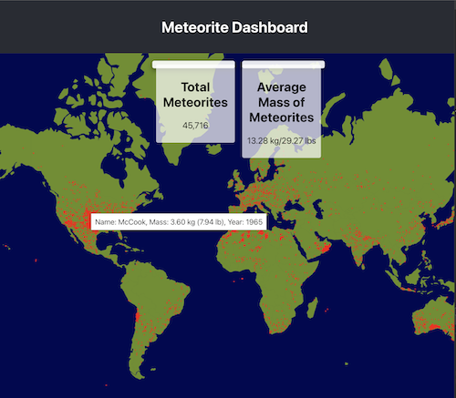

# MeteoriteLandingsDashboard
A web-based interactive visualization of meteorite landings around the world. The project uses D3.js for creating the visualization and React for the UI. Data is sourced from NASA's public data sets.
[Visit Dashboard](https://meteorite-landings-dashboard-kgil-djyq2x585.vercel.app/)

